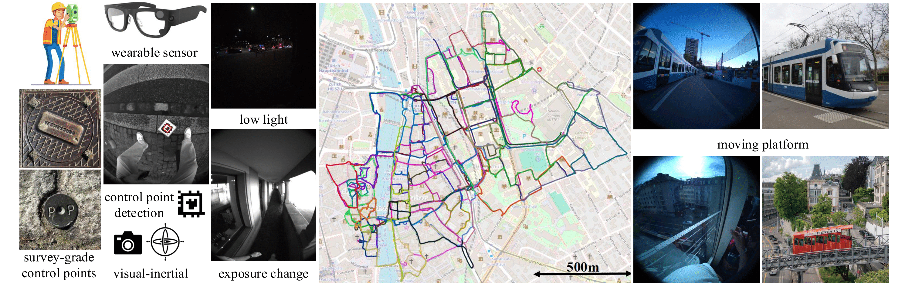

<p align="center">
  <h1 align="center"><ins>The LaMAria Dataset</ins> <br>Benchmarking Egocentric Visual-Inertial SLAM at City Scale</h1>
  <h4 align="center">
    <a href="https://github.com/nushakrishnan" target="_blank" rel="noopener noreferrer">Anusha&nbsp;Krishnan</a><sup>*</sup>, 
    <a href="https://github.com/B1ueber2y" target="_blank" rel="noopener noreferrer">Shaohui&nbsp;Liu</a><sup>*</sup>,
    <a href="https://github.com/sarlinpe" target="_blank" rel="noopener noreferrer">Paul-Edouard&nbsp;Sarlin</a><sup>*</sup>,
    Oscar&nbsp;Gentilhomme,<br>
    David&nbsp;Caruso,
    Maurizio&nbsp;Monge,
    Richard&nbsp;Newcombe,
    Jakob&nbsp;Engel,
    Marc&nbsp;Pollefeys
  </h4>
  <p align="center">
  <sup>*</sup>Equal contribution
  </p>
  <p align="center">
    <br/>
  </p>
</p>
<h3 align="center">
  <a href="https://lamaria.ethz.ch" target="_blank" rel="noopener noreferrer">Website</a> |
  <a href="" target="_blank" rel="noopener noreferrer">Paper</a>
</h3>


We present **LaMAria**, an egocentric, city-scale benchmark for **visual-inertial SLAM**, featuring 
~ **22 hours / 70 km** of trajectories with survey-grade control points providing **centimeter-accurate ground truth**.

Using **LaMAria**, you can:
- Evaluate SLAM systems under real-world egocentric setup: low light, moving platforms, exposure changes, time-varying sensor calibrations.
- Benchmark against highly accurate ground truths.

This dataset offers 23 training sequences and 63 test sequences. 

<p align="center">
  <br/>
  <em>Figure 1: Overview of the LaMAria dataset and benchmark.</em>
</p>

To learn more about the dataset, please visit our <a href="https://lamaria.ethz.ch" target="_blank" rel="noopener noreferrer">main dataset website</a> or read our <a href="" target="_blank" rel="noopener noreferrer">paper</a>.

## Table of Contents
- [Installation](#installation)
- [Downloading the Dataset](#downloading-the-dataset)
- [Evaluation](#evaluation)
  - [Evaluation w.r.t. Control Points](#evaluation-wrt-control-points)
  - [Evaluation w.r.t. Pseudo-GT](#evaluation-wrt-pseudo-gt)
  - [EVO Evaluation w.r.t. MPS](#evo-evaluation-wrt-mps)
- [Converting VRS to ASL/ROSbag format](#converting-vrs-to-aslrosbag-format)
- [Example Visual-Inertial Optimization](#example-visual-inertial-optimization)
- [BibTeX Citation](#bibtex-citation)


## Installation

Create an environment:
```bash
python3 -m venv lamaria_env
source lamaria_env/bin/activate
```

Install the package:
```bash
git clone git@github.com:cvg/lamaria.git
cd lamaria
pip install -r requirements.txt
python -m pip install -e .
```

## Downloading the dataset
Our dataset is fully hosted via the archive <a href="https://cvg-data.inf.ethz.ch/lamaria/" target="_blank" rel="noopener noreferrer">here</a>.

```bash
python -m tools.download_lamaria.py --help
```

For download convenience, we provide a custom script `tools/download_lamaria.py`. Using this script, you can download:
- Specific sequences or entire sets (training/test).
- Specific types:
  - Raw - Downloads raw `.vrs` files and Aria calibration file.
  - ASL - Downloads ASL folder and pinhole calibration file.
  - ROSbag - Downloads ROS1 bag and pinhole calibration file.
  - All - Downloads both raw and pinhole data.

Ground truth files are automatically downloaded for the training sequences. 

### Data sizes
- Raw data (vrs + aria_calibrations): ~890G (training: ~117G + test: ~773G)
- ASL folder + pinhole_calibrations: ~1.1T (training: ~170G + test: ~884G)
- ROSbag + pinhole_calibrations: ~1.5T (training: ~247G + test: ~1.3T)

### Some example commands

To download all training sequences in both raw and pinhole formats:
```bash
python -m tools.download_lamaria --set training --type all
```
To download the raw data of a specific sequence (e.g., `R_01_easy`):
```bash
python -m tools.download_lamaria --sequences R_01_easy --type raw
```
To download 3 custom sequences in rosbag format:
```bash
python -m tools.download_lamaria --sequences sequence_1_1 sequence 1_2 sequence 1_3 --type rosbag
```
To download 3 custom sequences in asl format:
```bash
python -m tools.download_lamaria --sequences sequence_1_1 sequence 1_2 sequence 1_3 --type asl
```

The downloaded raw data is stored in the following way:
```
out_dir/
└── lamaria/
    ├── training/
    │   ├── R_01_easy/
    │   │   ├── aria_calibrations/
    │   │   │   └── R_01_easy.json
    │   │   ├── ground_truth/
    │   │   │   ├── pseudo_dense/
    │   │   │   │   └── R_01_easy.txt
    │   │   │   └── sparse/
    │   │   │       └── # if sequence has CPs
    │   │   ├── raw_data/
    │   │   │   └── R_01_easy.vrs
    │   └── ...
    └── test/ # no ground truth
        └── sequence_1_1
```

For more information about the training and test sequences, refer to the <a href="https://lamaria.ethz.ch/slam_datasets" target="_blank" rel="noopener noreferrer">dataset details</a>. To learn more about the various data formats, calibration files and ground-truths, visit our <a href="https://lamaria.ethz.ch/slam_documentation" target="_blank" rel="noopener noreferrer">documentation</a>.

## Evaluation
Our training and test sequences are categorized into varying challenges. To evaluate your SLAM results on our data, we provide two main ways:
1. **Evaluation via the website**: Upload your results on our <a href="https://lamaria.ethz.ch/login" target="_blank" rel="noopener noreferrer">website</a> to get evaluation results. **All sequences can be submitted via our website.** Results on test sequences are displayed on the public [leaderboard](https://www.lamaria.ethz.ch/leaderboard).
2. **Standalone evaluation**: Run the evaluation scripts locally using the provided `lamaria` package. These scripts can be run only on the training sequences (since ground truth is required).

### Input format
The input pose estimate file must be a text file where each line corresponds to a timestamped pose in the following format:
```
timestamp tx ty tz qx qy qz qw
```
The timestamp must be in nanoseconds.

### Download demo data
We provide a small script `quickstart.sh` that downloads demo data from the archive. The standalone evaluations and example visual-inertial optimization can be run on the downloaded data.

```bash
chmod +x quickstart.sh
./quickstart.sh
```

The first sequence of the controlled experimental set (R_01_easy) and additional set (sequence_1_19) are stored in the `demo/` folder.

### Evaluation w.r.t. Control Points
Three sequences in the controlled experimental set and the additional set sequences can be evaluated w.r.t. control points. This script computes the score and control point recall based on the alignment of the estimated trajectory to the control points.

To perform the evaluation on the downloaded demo data:
```bash
python -m evaluate_wrt_control_points --estimate demo/estimate/sequence_1_19.txt --cp_json_file demo/cp_data/sequence_1_19.json --device_calibration_json demo/calibrations/sequence_1_19.json --output_path demo/eval_cp --corresponding_sensor imu
```

*This command evaluates the provided estimate w.r.t. control points and stores the results in `demo/eval_cp`. The `--corresponding_sensor` flag indicates which sensor the poses are expressed in (e.g., `imu` or `cam0`).*

To learn more about the control points and sparse evaluation, refer to Section 4.1 and 4.2 of our <a href="" target="_blank" rel="noopener noreferrer">paper</a>.

### Evaluation w.r.t Pseudo-GT
This script evaluates the estimated trajectory w.r.t. the pseudo-dense ground truth from our ground-truthing pipeline. It requires the alignment obtained from the sparse evaluation (w.r.t. control points). The script computes the pose recall @ 1m and @ 5m, after aligning the estimated trajectory to the pseudo-ground truth.

To perform the evaluation on the downloaded demo data:
```bash
python -m evaluate_wrt_pgt --estimate demo/estimate/sequence_1_19.txt --gt_estimate demo/pgt/sequence_1_19.txt --sparse_eval_result demo/eval_cp/sparse_eval_result.npy
```

### EVO Evaluation w.r.t MPS
This script evaluates the estimated trajectory w.r.t. the pseudo-dense ground truth from Machine Perception Services (MPS). It computes the Absolute Trajectory Error (ATE) RMSE between the two trajectories.

To perform the evaluation on the downloaded demo data:
```bash
python -m evaluate_wrt_mps --estimate demo/estimate/R_01_easy.txt --gt_estimate demo/mps/R_01_easy.txt
```

This method is used to evaluate results on the controlled experimental set.

## Converting VRS to ASL/ROSbag format

We provide some utility scripts in the `tools/` folder to convert between different data formats used in our dataset.

<details>
<summary>Click to expand commands</summary>
<br>

1. Converting from `.vrs` to ASL folder format:
```bash
python -m tools.vrs_to_asl_folder --vrs_file path/to/sequence.vrs --output_asl_folder path/to/output_asl_folder
``` 

2. Converting from ASL folder to ROS1 bag:
```bash
python -m tools.asl_folder_to_rosbag --input_asl_folder path/to/asl_folder --output_rosbag path/to/output.bag
```

3. Undistorting ASL folder images to PINHOLE format:
```bash
python -m tools.undistort_asl_folder.py --calibration_file path/to/calibration.json --asl_folder path/to/asl_folder --output_asl_folder path/to/output_undistorted_asl_folder
```
*Note: The undistortion script requires COLMAP to be installed from source. Please follow the instructions [here](https://colmap.github.io/install.html) to install the library.*

<!-- 4. Rotating ASL folder upright:
```bash
python -m tools.rotate_asl_folder --asl_folder path/to/asl_folder --output_asl_folder path/to/output_upright_asl_folder
``` -->
</details>

## Example Visual-Inertial Optimization

As a byproduct of our groundtruthing pipeline, we provide an example visual-inertial optimization pipeline built within the `lamaria` package. This pipeline takes as input a pose estimate file (in the format described below) and `.vrs`, performs keyframing and triangulation, and optimizes the trajectory using visual and inertial residuals.

The input pose estimate file must follow the same format as described in the [input format](#input-format) section above.

### Additional Installation
To extract images from a `.vrs` file, it is required to install the [VRS Command Line Tools](https://facebookresearch.github.io/vrs/docs/VrsCliTool/). Please follow the instructions [here](https://github.com/facebookresearch/vrs?tab=readme-ov-file#instructions-macos-and-ubuntu-and-container) to install the library from source.

### Running the example
To run the example visual-inertial optimization on the downloaded demo data:
```bash
./quickstart.sh
python -m example_vi_optimization --vrs demo/vrs/sequence_1_19.vrs --output demo/vi_optim/ --estimate demo/estimate/sequence_1_19.txt
```
TODO: Add two plots and caption.


## BibTeX citation
```bibtex
@InProceedings{Krishnan_2025_ICCV,
  author    = {Krishnan, Anusha and
               Liu, Shaohui and
               Sarlin, Paul-Edouard and
               Gentilhomme, Oscar and
               Caruso, David and
               Monge, Maurizio and
               Newcombe, Richard and
               Engel, Jakob and
               Pollefeys, Marc},
  title     = {Benchmarking Egocentric Visual-Inertial SLAM at City Scale},
  booktitle = {Proceedings of the IEEE/CVF International Conference on Computer Vision (ICCV)},
  year      = {2025}
}
```
